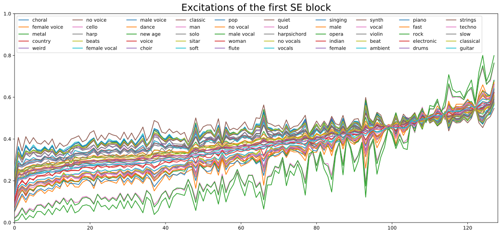

# Sample-level CNN Architectures for Music Auto-tagging Using Raw Waveforms
***A [TensorFlow][1]+[Keras][12] implementation of ["Sample-level CNN Architectures for 
Music Auto-tagging Using Raw Waveforms"][10]***



### Table of contents
* [Prerequisites](#prerequisites)
* [Preparing MagnaTagATune (MTT) Dataset](#preparing-mtt)
* [Preprocessing the MTT dataset](#preprocessing)
* [Training a model from scratch](#training)
* [Downloading pre-trained models](#download)
* [Evaluating a model](#evaluating)

### Citation
```
@inproceedings{kim2018sample,
  title={Sample-level CNN Architectures for Music Auto-tagging Using Raw Waveforms},
  author={Kim, Taejun and Lee, Jongpil and Nam, Juhan},
  booktitle={International Conference on Acoustics, Speech and Signal Processing (ICASSP)},
  year={2018},
  organization={IEEE}
}
```

### Table of contents
* [Prerequisites](#prerequisites)
* [Preparing MagnaTagATune (MTT) Dataset](#preparing-mtt)
* [Preprocessing the MTT dataset](#preprocessing)
* [Training a model from scratch](#training)
* [Downloading pre-trained models](#download)
* [Evaluating a model](#evaluating)

### TODO
- [ ] Excitation extraction script
- [ ] Excitation analysis notebook


<a name="prerequisites"></a>
## Prerequisites
* Python 3.5 and the required packages
* `ffmpeg` (required for `madmom`)

### Installing required Python packages
```bash
pip install -r requirements.txt
pip install madmom
```
The `madmom` package has a install-time dependency, so should be
installed after installing packages in `requirements.txt`.

This will install the required packages:
* [keras][12] must use `v2.0.5` (has an [issue](https://github.com/keras-team/keras/issues/8430))
* [tensorflow][1]
* [numpy][5]
* [pandas][2]
* [scikit-learn][3]
* [madmom][4]
* [scipy][6] (madmom dependency)
* [cython][7] (madmom dependency)
* [matplotlib][15] (used for excitation analysis)

### Installing ffmpeg
`ffmpeg` is required for `madmom`.

#### MacOS (with Homebrew):
```bash
brew install ffmpeg
```

#### Ubuntu:
```bash
add-apt-repository ppa:mc3man/trusty-media
apt-get update
apt-get dist-upgrade
apt-get install ffmpeg
```

#### CentOS:
```bash
yum install epel-release
rpm --import http://li.nux.ro/download/nux/RPM-GPG-KEY-nux.ro
rpm -Uvh http://li.nux.ro/download/nux/dextop/el ... noarch.rpm
yum install ffmpeg
```


<a name="preparing-mtt"></a>
## Preparing MagnaTagATune (MTT) dataset
Download audio data and tag annotations from [here][8]. Then you should
see 3 `.zip` files and 1 `.csv` file:
```bash
mp3.zip.001
mp3.zip.002
mp3.zip.003
annotations_final.csv
```

To unzip the `.zip` files, merge and unzip them (referenced [here][9]):
```bash
cat mp3.zip.* > mp3_all.zip
unzip mp3_all.zip
```

You should see 16 directories named `0` to `f`. Typically, `0 ~ b` are
used to training, `c` to validation, and `d ~ f` to test.

To make your life easier, make a directory named `dataset`, and place them in the directory as below:
```bash
mkdir dataset
```
Your directory structure should be like:
```
dataset
├── annotations_final.csv
└── mp3
    ├── 0
    ├── 1
    ├── ...
    └── f
```

Now, the MTT dataset preparation is Done!


<a name="preprocessing"></a>
## Preprocessing the MTT dataset
This section describes a required preprocessing task for the MTT
dataset. Note that this requires `48G` storage space. It uses multiprocessing.

These are what the preprocessing does:
* Select top 50 tags in `annotations_final.csv`
* Split dataset into training, validation, and test sets
* Resample the raw audio files to 22050Hz
* Segment the resampled audios into `59049` sample length
* Convert the segments to TFRecord format

To run the preprocessing:
```bash
python build_mtt.py
```

After the preprocessing your `dataset` directory should be like:
```
dataset
├── annotations_final.csv
├── mp3
│   ├── 0
│   ├── ...
│   └── f
└── tfrecord
    ├── test-0000-of-0043.seq.tfrecord
    ├── ...
    ├── test-0042-of-0043.seq.tfrecord
    ├── train-0000-of-0152.tfrecord
    ├── ...
    ├── train-0151-of-0152.tfrecord
    ├── val-0000-of-0015.tfrecord
    ├── ...
    └── val-0014-of-0015.tfrecord

18 directories, 211 files
```


<a name="training"></a>
## Training a model from scratch
To train a model from scratch, run the code:
```bash
python train.py
```
The trained model and logs will be saved under the directory `log`.

### Training a model with options
`train.py` trains a model using `SE` block by default. To see configurable options,
run `python train.py -h`. Then you will see:
```bash
usage: train.py [-h] [--data-dir PATH] [--train-dir PATH]
                [--block {se,rese,res,basic}] [--no-multi] [--alpha A]
                [--batch-size N] [--momentum M] [--lr LR] [--lr-decay DC]
                [--dropout DO] [--weight-decay WD] [--initial-stage N]
                [--patience N] [--num-lr-decays N] [--num-audios-per-shard N]
                [--num-segments-per-audio N] [--num-read-threads N]

Sample-level CNN Architectures for Music Auto-tagging.

optional arguments:
  -h, --help            show this help message and exit
  --data-dir PATH
  --train-dir PATH      Directory where to write event logs and checkpoints.
  --block {se,rese,res,basic}
                        Block to build a model: {se|rese|res|basic} (default:
                        se).
  --no-multi            Disables multi-level feature aggregation.
  --alpha A             Amplifying ratio of SE block.
  --batch-size N        Mini-batch size.
  --momentum M          Momentum for SGD.
  --lr LR               Learning rate.
  --lr-decay DC         Learning rate decay rate.
  --dropout DO          Dropout rate.
  --weight-decay WD     Weight decay.
  --initial-stage N     Stage to start training.
  --patience N          Stop training stage after #patiences.
  --num-lr-decays N     Number of learning rate decays.
  --num-audios-per-shard N
                        Number of audios per shard.
  --num-segments-per-audio N
                        Number of segments per audio.
  --num-read-threads N  Number of TFRecord readers.
```

For example, if you want to train a model without multi-feature aggregation using `Res` block:
```bash
python train.py --block res --no-multi
```


<a name="download"></a>
## Downloading pre-trained models
You can download the two best models of the paper:
* **SE+multi** (AUC 0.9111) [[download][13]]: a model using `SE` blocks and multi-feature aggregation
* **ReSE+multi** (AUC 0.9113) [[download][14]]: a model using `ReSE` blocks and multi-feature aggregation

To download them from command line:
```bash
# SE+multi
curl -L -o se-multi-auc_0.9111-tfrmodel.hdf5 https://www.dropbox.com/s/r8qlxbol2p4ods5/se-multi-auc_0.9111-tfrmodel.hdf5?dl=1

# ReSE+multi
curl -L -o rese-multi-auc_0.9113-tfrmodel.hdf5 https://www.dropbox.com/s/fr3y1o3hyha0n2m/rese-multi-auc_0.9113-tfrmodel.hdf5?dl=1
```


<a name="evaluating"></a>
## Evaluating a model
To evaluate a model run:
```bash
python eval.py <MODEL_PATH>
```
For example, if you want to evaluate the downloaded `SE+multi` model:
```bash
python eval.py se-multi-auc_0.9111-tfrmodel.hdf5
```


[1]: https://www.tensorflow.org/
[2]: http://pandas.pydata.org/
[3]: https://www.scipy.org/
[4]: https://madmom.readthedocs.io/en/latest/
[5]: http://www.numpy.org/
[6]: https://www.scipy.org
[7]: http://cython.org/
[8]: http://mirg.city.ac.uk/codeapps/the-magnatagatune-dataset
[9]: https://github.com/keunwoochoi/magnatagatune-list
[10]: https://arxiv.org/abs/1710.10451
[11]: https://github.com/tensorflow/tensorflow/tree/master/tensorflow/contrib/slim
[12]: https://keras.io/
[13]: https://www.dropbox.com/s/r8qlxbol2p4ods5/se-multi-auc_0.9111-tfrmodel.hdf5?dl=1
[14]: https://www.dropbox.com/s/fr3y1o3hyha0n2m/rese-multi-auc_0.9113-tfrmodel.hdf5?dl=1
[15]: https://matplotlib.org/
